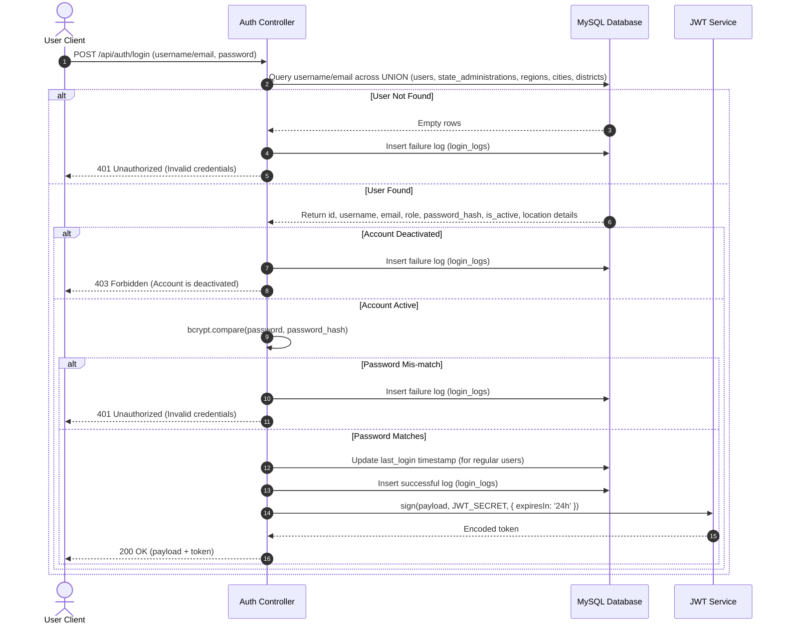

# Somali Police Force Case Management System
## Core Project Blueprint - Part 5: Authentication & Authorization

This document serves as Part 5 of the comprehensive system blueprint for the Somali Police Force Case Management System, detailing authentication mechanisms, roles structures, JWT specifications, and routing permissions validation gates.

---

## 5. Security & Access Control Infrastructure

### 5.1. The Unified Authentication Flow
The system processes login requests using a unified authentication algorithm that aggregates credentials checks across different databases tables:



### 5.2. Password Hashing Specification
* **Library**: `bcryptjs`
* **Workflow**: On user creation or password updates, passwords undergo 12 salt rounds hashing.
* **Storage Column**: `password_hash` (`VARCHAR(255)`)

---

### 5.3. JWT & Session Implementation
Authentication is token-based. Clients must attach the returned JWT token to every request inside the `Authorization` header prefixed with `Bearer `.

#### Token Payload Schema:
```json
{
  "id": 1,
  "username": "admin",
  "email": "admin@spf.gov.so",
  "role": "admin",
  "roleCode": "admin",
  "fullName": "System Admin",
  "phone": "+252611111111",
  "rank": "General",
  "userType": "COMMANDER",
  "assignedLevel": "ADMINISTRATION",
  "isCommander": true,
  "scopeType": null,
  "scopeId": null,
  "location": {
    "stateId": 1,
    "stateName": "Banadir",
    "regionId": null,
    "regionName": null,
    "districtId": null,
    "districtName": null
  },
  "iat": 1721245000,
  "exp": 1721331400
}
```
* **Expiration Time**: Fixed at `24h` (configurable in `JWT_EXPIRES_IN` env).

---

### 5.4. Middleware Gates

1. **Authentication Gate (`authMiddleware.js`)**:
   * Extracts token from `Authorization` header.
   * Runs `jwt.verify(token, process.env.JWT_SECRET)`.
   * Sets `req.user = decoded` on success.
   * Catches `TokenExpiredError` (returns `401 Token has expired`) or invalid signatures (returns `401 Invalid token`).
2. **Authorization Role Gate (`roleMiddleware.js`)**:
   * Evaluates permissions using `allowRoles(...roles)` factory.
   * Matches `req.user.role` against list. On failure, responds with `403 Access Denied`.

---

### 5.5. Permission Matrix Per Role

| Role | OB Entries (Read/Write) | Cases (Read/Write) | Assignments/Transfers | CID Investigations | Custody & Bookings | Judicial Hearings |
| :--- | :---: | :---: | :---: | :---: | :---: | :---: |
| **admin** | Write / Read | Write / Read | Write / Read | Write / Read | Write / Read | Write / Read |
| **ob_staff** | Write / Read | Read | No | No | No | No |
| **officer** | Write / Read | Write / Read | Read | Read | Read | Read |
| **state_commander** | Read | Read | Write / Read | Read | Read | Read |
| **region_commander** | Read | Read | Write / Read | Read | Read | Read |
| **district_commander** | Read | Read | Write / Read | Read | Read | Read |
| **police_station_commander** | Read | Read | Write / Read | Read | Read | Read |
| **state_admin** | Read | Read | No | No | No | No |
| **region_admin** | Read | Read | No | No | No | No |
| **city_admin** | Read | Read | No | No | No | No |
| **district_admin** | Write / Read | Write / Read | Write / Read | Read | Read | Read |
| **cid_director** | Read | Write / Read | Read | Write / Read | Read | Read |
| **cid_supervisor** | Read | Write / Read | Read | Write / Read | Read | Read |
| **cid_officer** | Read | Write / Read | Read | Write / Read | Read | Read |
| **prosecutor** | Read | Read | No | Read | Read | Write / Read |
| **judge** | Read | Read | No | Read | Read | Write / Read |
| **court_clerk** | Read | Read | No | No | Read | Write / Read |
| **jail** | Read | Read | No | No | Write / Read | No |
