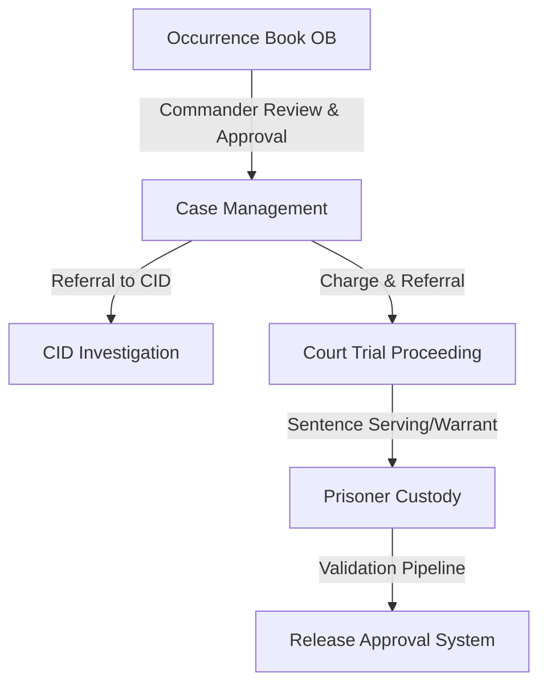

# Somali Police Force Case Management System
## Core Project Blueprint - Part 6: Business Modules Specification

This document serves as Part 6 of the comprehensive system blueprint for the Somali Police Force Case Management System, detailing business objectives, logic engines, status transitions, validation parameters, and relationships between the four core operations modules.

---

## 6. Functional Module Specification

---

### 6.1. Module 1: Occurrence Book & Case Management

#### 6.1.1. Purpose
The entry point of information. Digitizes local complaints, converts them into formal cases, allows commanders to assign police personnel, and guides investigations from drafts to judicial escalation.

#### 6.1.2. Main Implementation Files
* **Controller**: `backend/src/controllers/caseController.js`, `obEntryController.js`
* **Router**: `backend/src/routes/caseRoutes.js`, `obEntryRoutes.js`
* **Services**: `backend/src/services/cidService.js`, `courtService.js`

#### 6.1.3. Database Mappings
* Primary tables: `ob_entries`, `cases`, `case_confirmations`, `case_actions`, `case_transfers`.
* Ancillary tables: `complainants`, `criminals`, `case_criminals`, `victims`, `case_victims`, `witnesses`, `witness_statements`, `evidence`.

#### 6.1.4. Key Business & Transition Rules
* **Occurrence Book (OB) Entry Conversion**:
  * Status starts at `OB_REGISTERED`.
  * Converting an OB entry creates a matching entry in the `cases` table and updates `ob_entries.status` to `CONVERTED_TO_CASE`.
* **Case Status Validation**:
  * Status checks follow `CASE_STATUS_FLOW`:
    * `draft` -> `registered`
    * `registered` -> `under_investigation`
    * `under_investigation` -> `referred_to_cid` OR `ready_for_court` OR `forwarded_to_court`
    * `referred_to_cid` -> `under_investigation` OR `ready_for_court` OR `forwarded_to_court` OR `approved_for_court`
    * `ready_for_court` -> `forwarded_to_court` OR `approved_for_court`
    * `forwarded_to_court` -> `court_decided`
    * `court_decided` -> `closed` -> `archived`
* **Date validation**: Incident time must be at least one hour in the past (`validateIncidentDate`).

---

### 6.2. Module 2: CID (Criminal Investigation Department)

#### 6.2.1. Purpose
Manages investigations of high-priority felonies, forensic tracking of crime scenes, supervisor reviews, and preparing legal dossiers for prosecution liaison.

#### 6.2.2. Main Implementation Files
* **Controller**: `backend/src/controllers/cidController.js`
* **Router**: `backend/src/routes/cidRoutes.js`
* **Services**: `backend/src/services/cidService.js`

#### 6.2.3. Database Mappings
* Primary tables: `cid_cases`, `cid_progress_notes`, `cid_crime_scenes`, `cid_reports`.
* Shared tables: `cases`, `evidence`, `case_criminals`, `arrests`.

#### 6.2.4. Key Business Rules
* **Auto-Synchronization**: Accessing the CID dashboard invokes `syncAllCidCases`, ensuring any case flagged as `referred_to_cid` at the local level is automatically synchronized to the `cid_cases` workspace.
* **Investigation Lifecycles**:
  * Default status: `open`.
  * Transitions: `open` -> `under_investigation` -> `evidence_collection` -> `witness_interviews` -> `suspect_tracking` -> `arrest_made` -> `investigation_completed` -> `supervisor_review` -> `approved` -> `sent_to_prosecutor` / `sent_to_court`.
* **Acknowledge Check**: The assigned CID officer must acknowledge receipt of a case before updating investigation notes.

---

### 6.3. Module 3: Prisoner Custody Management

#### 6.3.1. Purpose
Coordinates prisoner bookings, facility transfers, visitor logs, medical histories, and the strict multi-signoff prisoner release validation chain.

#### 6.3.2. Main Implementation Files
* **Controller**: `backend/src/controllers/custodyController.js`
* **Router**: `backend/src/routes/custodyRoutes.js`

#### 6.3.3. Database Mappings
* Primary tables: `biometric_identifiers`, `prisoner_documents`, `prison_transfers`, `prisoner_medical_records`, `prisoner_visitor_logs`, `release_approvals`.
* Core reference tables: `criminals` (suspect identifier), `arrests` (sentence identifier), `districts` (station reference).

#### 6.3.4. Key Business Rules
* **Biometrics Mappings**:
  * Recording a suspect's fingerprint or face biometrics automatically updates the global `criminals` index column `fingerprint_hash`.
* **Release Approval Validation Pipeline**:
  * To release a prisoner, a release approval workflow is initialized.
  * Release approval status transition flow:
    1. `pending_admin_review`: Triggered by a jail custodian.
    2. `admin_reviewed`: Checked and approved by the administrator.
    3. `court_approved`: Checked and confirmed by the presiding judge/court.
    4. `prison_confirmed`: Confirmed by the prison supervisor.
    5. `certificate_generated`: The system generates a certificate number: `REL-[YEAR]-[APPROVAL_ID_PADDED]`.
    6. `released`: Prisoner record is closed.

---

### 6.4. Module 4: Legal & Judicial Court Module

#### 6.4.1. Purpose
Tracks court prosecutions, hearings schedules, testimonies, trial proceedings, and sentences.

#### 6.4.2. Main Implementation Files
* **Controller**: `backend/src/controllers/courtController.js`
* **Router**: `backend/src/routes/courtRoutes.js`
* **Services**: `backend/src/services/courtService.js`

#### 6.4.3. Database Mappings
* Primary tables: `court_cases`, `court_hearings`, `court_witnesses`, `court_evidence_notes`, `court_proceedings`, `court_judgments`, `court_sentences`, `court_appeals`.

#### 6.4.4. Key Business Rules
* **Referred Intake**:
  * When a case status changes to `forwarded_to_court` in local case management, `ensureCourtCaseForPoliceCase` creates a court docket under status `registered`.
* **Trial status changes**:
  * Transitions: `registered` -> `awaiting_hearing` -> `hearing_scheduled` -> `in_trial` -> `judgment_issued` -> `sentenced` -> `closed`.
* **Outcomes Linking**:
  * Recording a `court_judgment` updates `court_cases.final_outcome` to `convicted`, `acquitted`, or `dismissed`.
  * If a suspect is convicted, the judge submits a sentence mapping duration, fines, and jail assignments, linking back to the prisoner custody booking.
