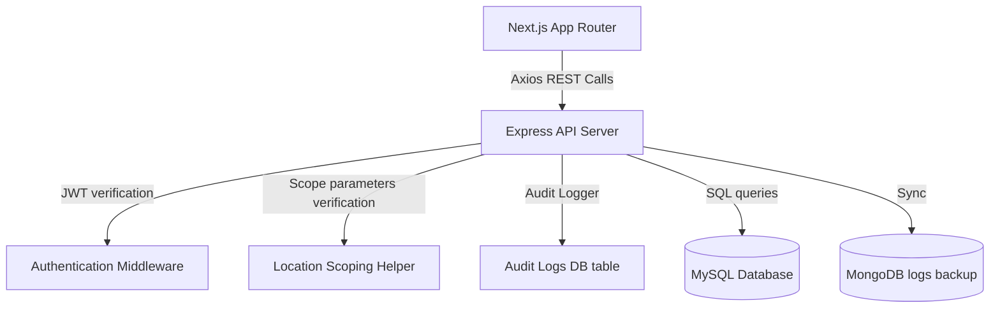

# Somali Police Force Case Management System
## Core Project Blueprint - Part 8: Deployment, Code Statistics, & Appendix

This document serves as Part 8 of the comprehensive system blueprint for the Somali Police Force Case Management System, detailing configuration structures, production deployment guides, file statistics, and glossary indices.

---

## 8. Deployment, System Statistics, & Glossary

### 8.1. Local & Production Deployment Guides

#### 8.1.1. System Prerequisites
* **Runtime**: Node.js (>= v18.0)
* **DBMS**: MySQL Server (>= 8.0)
* **MongoDB**: Running instance (for syncing logs or background caches)

#### 8.1.2. Local Development Setup
1. **Repository Setup**:
   Clone the repository and locate both the `backend` and `frontend` folders.
2. **Environment Variables**:
   * Create a `.env` file in the `backend` folder:
     ```env
     PORT=5000
     DB_HOST=localhost
     DB_USER=root
     DB_PASSWORD=yourpassword
     DB_NAME=police_cms
     JWT_SECRET=yourjwtsecretkey
     JWT_EXPIRES_IN=24h
     MONGODB_URI=mongodb://localhost:27017/police_cms_logs # Optional (Not required for the app to run)
     ```
   * Create a `.env` file in the `frontend` folder:
     ```env
     NEXT_PUBLIC_API_URL=http://localhost:5000/api
     ```
3. **Database Initialization**:
   * Open MySQL client and run the database initialization schema:
     ```bash
     mysql -u root -p < backend/database/schema.sql
     ```
   * Seed the initial administrative structures, roles, and ranks:
     ```bash
     node backend/database/seed.js
     ```
4. **Installing Dependencies**:
   * Inside the `/backend` folder: `npm install`
   * Inside the `/frontend` folder: `npm install`
5. **Running Locally**:
   * Backend server: `node src/app.js` (starts on port 5000)
   * Frontend next app: `npm run dev` (starts on port 3000)

#### 8.1.3. Production Build & Deployment
* **Backend PM2 Process Management**:
  Deploy using a process manager like PM2 to guarantee automatic restarts:
  ```bash
  npm install -g pm2
  pm2 start src/app.js --name "spf-case-system-backend"
  ```
* **Next.js Production Build**:
  Compile Next.js client-side assets to optimized production build folder:
  ```bash
  npm run build
  npm run start
  ```

---

### 8.2. Source Code Statistics

| Metric | Measured Value |
| :--- | :--- |
| **Combined Source Files (`/backend/src` & `/frontend/src`)** | 119 files |
| **Combined Source Folders** | 48 directories |
| **REST Router files** | 28 route modules |
| **REST Controller files** | 28 controller modules |
| **Database Schema Tables (`schema.sql`)** | 37 tables |
| **TODO/FIXME comments** | None found |

---

### 8.3. Module Dependency Graph



---

### 8.4. Appendix & Glossary

#### 8.4.1. Terms & Definitions
* **OB (Occurrence Book)**: The primary logbook at a police station where all initial complaints are logged.
* **CID**: Criminal Investigation Department. Responsible for complex felony cases.
* **5-Tier Scope**: State Administration -> Region -> City -> District -> Local Station.
* **Scoping**: Data visibility bounds checked dynamically using the user's location IDs.

#### 8.4.2. Code Naming Conventions
* **Database Columns**: snake_case (e.g. `case_number`, `assigned_officer_id`).
* **Express Routes & Controllers**: camelCase (e.g. `getObEntries`, `createCase`).
* **React Components**: PascalCase (e.g. `TopNavbar.jsx`, `StandardDashboard.jsx`).

#### 8.4.3. Shared System Utilities
* `writeAuditLog`: Saves actions to the `audit_logs` table.
* `generateCaseNumber`: Creates unique incrementing codes formatted like `CASE-YYYY-XXXXXX`.
* `generateOBNumber`: Creates unique codes formatted like `OB-YYYY-XXXXXX`.
